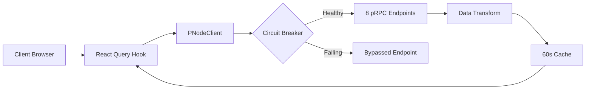

<div align="center">

#  XandNodes
### **The Xandeum Command Center**
*Professional-Grade pNode Network Analytics & Real-Time Intelligence*

[](https://nextjs.org/)
[](https://react.dev/)
[](https://www.typescriptlang.org/)
[](https://tailwindcss.com/)
[](https://github.com/Dairus01/XandNodes)

[Explore Documentation](/docs) • [View Live Dashboard](/) • [Report Operational Issue](https://github.com/Dairus01/XandNodes/issues)

</div>

---

## ⚡ Mission Briefing
**XandNodes** is a state-of-the-art telemetry and intelligence platform designed for the Xandeum decentralized storage network. It translates raw pRPC gossip data from distributed pNodes into actionable, high-fidelity insights through a "Digital Bioluminescence" interface.

### 🛡️ Operational Status: **ACTIVE**
Monitoring **8 High-Priority Endpoints** with integrated circuit-breaker resilience and parallel data ingestion.

---

## 🏗️ Tactical Capabilities

<table width="100%">
  <tr>
    <td width="50%" valign="top">
      <h4>📡 Real-Time Surveillance</h4>
      <ul>
        <li><b>Live Data Ingestion</b>: Sub-second monitoring of 8 pRPC endpoints.</li>
        <li><b>Parallel Processing</b>: Simultaneous querying for maximum throughput.</li>
        <li><b>Circuit-Breaker Logic</b>: Automatic isolation of failing infrastructure.</li>
      </ul>
    </td>
    <td width="50%" valign="top">
      <h4>🧬 Intelligence Layer</h4>
      <ul>
        <li><b>Weighted Scoring</b>: A-F grading optimized for storage networks.</li>
        <li><b>Risk Assessment</b>: Instant detection of capacity/uptime vectors.</li>
        <li><b>Bioluminescent UI</b>: Glassmorphic maps and interactive HUDs.</li>
      </ul>
    </td>
  </tr>
  <tr>
    <td width="50%" valign="top">
      <h4>🌍 Geopolitical Mapping</h4>
      <ul>
        <li><b>Global Topology</b>: Interactive plotting of all active node locations.</li>
        <li><b>Provider Diversity</b>: Real-time tracking of country-level distribution.</li>
        <li><b>Latency Heatmaps</b>: Regional performance profiles for edge analysis.</li>
      </ul>
    </td>
    <td width="50%" valign="top">
      <h4>📦 Exabyte Scalability</h4>
      <ul>
        <li><b>Capacity Projection</b>: Monitoring network growth milestones.</li>
        <li><b>Data Export</b>: Industrial-grade CSV/JSON extraction for analysts.</li>
        <li><b>Version Audits</b>: Tracking software synchronization lifecycle.</li>
      </ul>
    </td>
  </tr>
</table>

---

## 🚀 Deployment Protocol

### **1. Environment Synchronization**
```bash
git clone https://github.com/Dairus01/XandNodes.git
cd XandNodes
```

### **2. Dependencies Ingestion**
```bash
npm install
```

### **3. Operational Launch**
```bash
npm run dev
```
> **Access link established at**: `http://localhost:3000`

---

## 📐 Network Architecture

### **Core Stack**
*   **Engine**: Next.js 16.1 (App Router Architecture)
*   **State**: TanStack React Query v5 (Smart Caching Layer)
*   **Styling**: Tailwind CSS 4.0 (Digital Bioluminescence Theme)
*   **Visuals**: Recharts 3 + Framer Motion (Dynamic Pulse)

### **Data Flow Pipeline**


---

## 📊 Health Scoring Formula (v1.0)
Xandeum network health is calculated using a storage-priority algorithm:

| Component | Weight | Target Metric |
| :--- | :--- | :--- |
| **Storage Health** | 30% | 60-80% Capacity Utilization |
| **Availability** | 30% | Active Response Percentage |
| **Version Health** | 25% | Synchronized Software Status |
| **Distribution** | 15% | Geographic Fault Tolerance |

---

## 🧪 Operational Data Schema
The platform standardizes raw pRPC output into the following tactical schema:

```typescript
interface PNode {
  publicKey: string;
  moniker: string;
  status: 'active' | 'inactive' | 'syncing';
  uptime: number;
  healthScore: number;
  storage: {
    used: number;
    total: number;
    usagePercentage: number;
  };
  performance: {
    avgLatency: number;
    successRate: number;
  };
  location: {
    country: string;
    city: string;
    lat: number;
    lng: number;
  };
}
```

---

## 📂 Command Structure
```bash
src/
├── app/          # Tactical Routing & Documentation
├── components/   # Visual Interface Subsystems
├── lib/          # Intelligence & Client Logic
├── types/        # Operational Data Schemas
└── public/       # Static Mission Assets
```

---

## 🤝 Contribution Guidelines
Operational improvements are welcome.
1. Fork the operational branch.
2. Implement tactical upgrades (Follow Tailwind/TS strict guidelines).
3. Open a Pull Request for code review.

---

<p align="center">
  <b>Project XandNodes</b> • Built by XandNodes Team • December 2025<br>
  <i>Empowering the Solana Exabyte Storage Mission.</i>
</p>
