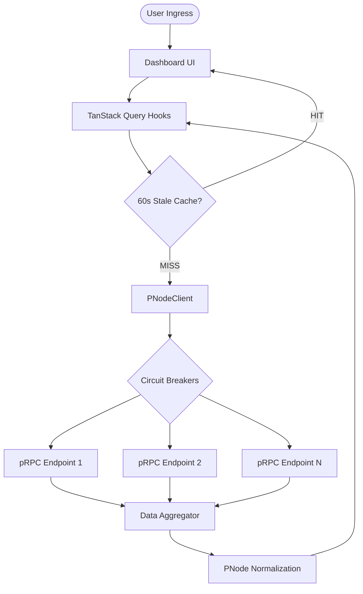

<div align="center">

#  XandNodes
### **The Xandeum Command Center**
*Professional-Grade pNode Network Analytics & Real-Time Intelligence*

[](https://nextjs.org/)
[](https://react.dev/)
[](https://www.typescriptlang.org/)
[](https://tailwindcss.com/)
[](https://github.com/Dairus01/XandNodes)

[Explore Documentation](/docs) • [View Live Dashboard](/) • [Report Operational Issue](https://github.com/Dairus01/XandNodes/issues)

</div>

---

## ⚡ Mission Briefing
**XandNodes** is a high-fidelity monitoring and intelligence platform purpose-built for the Xandeum decentralized storage network. In the pursuit of exabyte-scale storage for Solana, the network requires professional-grade observability. XandNodes fulfills this by aggregating pRPC gossip data from distributed pNodes into a unified "Digital Bioluminescence" interface.

### 🛡️ Operational Status: **ACTIVE**
The platform currently monitors **8 verified Xandeum pRPC endpoints** (Port 6000) using a high-concurrency ingestion engine equipped with circuit-breaker protection.

---

## 🏗️ Technical Architecture & Capabilities

XandNodes is built on a "Resilience-First" architecture, ensuring that the dashboard remains responsive even when parts of the decentralized network are suffering from high latency or downtime.

### **1. Resilience & Ingestion Layer**
*   **Parallel Querying**: Instead of sequential requests, XandNodes queries all target pRPC endpoints simultaneously.
*   **Circuit Breaker Pattern**: If an endpoint fails or exceeds the 5-second timeout, the platform automatically flags it and bypasses it in subsequent cycles to prevent UI "locking."
*   **Fail-Fast Ingestion**: We prioritize data freshness over completion. If 6/8 nodes report on time, the dashboard renders immediately.

### **2. The Insight Engine**
The platform features a logic-based "Intelligence Layer" that analyzes raw stats to generate tactical events:
*   **Capacity Milestones**: Alerts when the network hits significant storage thresholds.
*   **Risk Categorization**: Automatically groups nodes into "Critical," "Warning," or "Healthy" vectors based on storage saturation and uptime.
*   **Version Drift Detection**: Identifies nodes running outdated software and calculates the network'sUpgrade Funnel.

---

## 📊 Precision Health Scoring (v2.0)

XandNodes utilizes a sophisticated 6-component scoring algorithm weighted specifically for a storage-centric decentralized network.

| Component | Weight | Target Threshold | Logic Description |
| :--- | :--- | :--- | :--- |
| **Uptime Health** | 25% | >99% | Exponential growth curve based on continuous operation minutes. |
| **Availability** | 25% | 100% | Real-time check of active status across the pNode gossip fleet. |
| **Performance** | 17% | <100ms | Dynamic score degradation based on pRPC response latency. |
| **Version Health** | 12.5% | Latest | Measures alignment with the current network-wide protocol version. |
| **Storage Health** | 12.5% | 60-80% | Incentivizes active storage without hitting critical capacity (95%+). |
| **Distribution** | 8.0% | Global | Geographic diversity score to ensure network fault tolerance. |

*Note: All scores are normalized and clamped between 0 and 100 for consistent grading.*

---

## 🚀 Deployment & Local Protocol

### **1. Hardware Requirements**
*   **CPU**: 2+ Cores (for parallel data processing)
*   **RAM**: 4GB+ (for local build optimization)
*   **Node.js**: v20.x or higher

### **2. Quick Start**
```bash
# Clone the tactical repository
git clone https://github.com/Dairus01/XandNodes.git
cd XandNodes

# Install the Next.js/React 19 ecosystem
npm install

# Start the Command Center in Development Mode
npm run dev
```

### **3. Production Uplink**
```bash
# Generate optimized static and server-side assets
npm run build

# Launch production server
npm run start
```

---

## 📐 Command Center Data Flow

XandNodes uses a smart-caching pipeline to minimize network stress while ensuring data accuracy.



---

## 🧪 Operational Data Schema

Every node in the network is transformed into a standardized `PNode` tactical object for analytics:

```typescript
interface PNode {
  publicKey: string;      // Unique Solana identifier
  moniker: string;        // Human-readable node name
  status: 'active' | 'inactive' | 'syncing';
  uptime: number;         // Historical reliability percentage
  healthScore: number;    // Calculated 0-100 composite
  storage: {
    used: number;         // Bytes stored
    total: number;        // Capacity
    usagePercentage: number;
  };
  performance: {
    avgLatency: number;   // In Milliseconds
    successRate: number;  // 0.0 - 1.0 reliability
  };
  location: {
    country: string;      // Geo-resolved entity
    city: string;
    lat: number;          // Visual plotting coordinate
    lng: number;
  };
}
```

---

## 📂 Command Structure & Directory Map

```bash
src/
├── app/                  # Next.js App Router (Routing Layer)
│   ├── api/             # pRPC Proxy and Data Ingestion logic
│   ├── docs/            # Comprehensive platform documentation
│   └── nodes/           # Node Explorer and specific pNode profiles
├── components/           # UI Subsystems
│   ├── ui/              # Shadcn/Radix primitive components
│   ├── GlassCard.tsx    # Premium themed wrapper
│   └── NetworkPulse.tsx # Real-time Recharts visualizations
├── lib/                  # Tactical Logic
│   ├── pnode-client.ts  # Parallel ingestion & Circuit Breakers
│   ├── intelligence.ts  # Health Scoring & Insight Engine
│   └── hooks.ts         # Server-state management (React Query)
└── types/                # Strict Type Definitions
```

---

## 🛠️ Operational Guidelines & Contributions

We maintain a strict technical standard to ensure the "Command Center" remains a production-grade tool.

1.  **Strict Typing**: No `any` types allowed in the core analytics logic.
2.  **Theme Compliance**: All new components must use the "Digital Bioluminescence" CSS variables.
3.  **Atomic Commits**: Ensure each PR addresses a specific tactical goal (e.g., "feat: add latency heatmap").
4.  **No Emojis in Code**: Keep the codebase professional. Emojis are reserved for the README and documentation UI.

---

<p align="center">
  <b>Project XandNodes</b> • Built by Dairus01 for Xandeum Labs • December 2025<br>
  <i>Enabling Solana's Storage Future, One pNode at a Time.</i>
</p>
